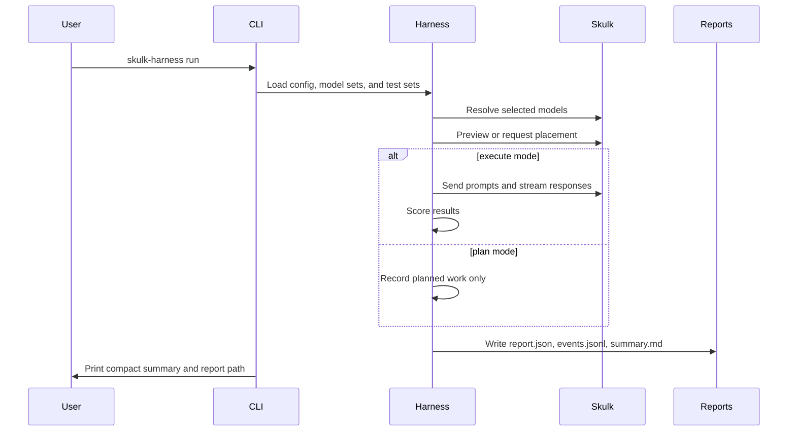

The harness has a few simple building blocks. Once you understand them, the CLI
commands and reports become much easier to read.

## Building Blocks

| Building block | File or command | Meaning |
| --- | --- | --- |
| Harness config | `skulk-harness.yaml` | Local settings such as API URL and config paths |
| Model set file | `configs/model_sets.yaml` | Named groups of models to test |
| Test set file | `configs/test_sets.yaml` | Named groups of prompts and checks |
| Run spec | CLI flags | The selected model set, test set, mode, and placement policy |
| Report | `runs/<run-id>/` | Machine and human-readable results |

## Run Lifecycle



_Figure 1: Plan mode stops before live prompt execution. Execute mode sends real
requests and scores responses._

## Plan Mode

Plan mode is the default. It helps you answer:

- Which models did this model set resolve to?
- Which placements would be attempted?
- Which report directory will be written?
- Is the harness able to talk to the cluster?

Use either of these forms:

```bash
uv run skulk-harness plan --model-set store-smoke --test-set chat-tests
uv run skulk-harness run --model-set store-smoke --test-set chat-tests
```

The second command uses `run`, but it is still a dry-run because `--execute`
is absent.

## Execute Mode

Execute mode can mutate the cluster. It may ask Skulk to place a model, run
tests, and tear down instances created by the harness:

```bash
uv run skulk-harness run \
  --model-set store-smoke \
  --test-set chat-tests \
  --execute \
  --delete-created-instances
```

Use `--retain-instances` when you intentionally want to leave created instances
running after the run.

## Natural-Language Goals

The `goal` command accepts a constrained natural-language request and maps it to
a known model set and test set:

```bash
uv run skulk-harness goal "run chat tests against the store smoke models"
```

This is helpful for agent workflows, but explicit `--model-set` and
`--test-set` flags are easier when you are learning.

## Output Contract

Every normal plan or run writes:

| File | Purpose |
| --- | --- |
| `report.json` | Complete structured report, including a fingerprint of what produced it |
| `events.jsonl` | One event per line for automation |
| `summary.md` | Human-readable summary |

Stability suites write `report.json` and `summary.md`.

Reports are durable inputs, not just output: two run sets can be
[compared like-for-like](../guides/compare-runs.md), and an executed run can
be [submitted to the community benchmarks ledger](../guides/submit-to-the-ledger.md).
The fingerprint inside `report.json` is what makes both trustworthy; see the
[reports reference](../reference/reports.md).
