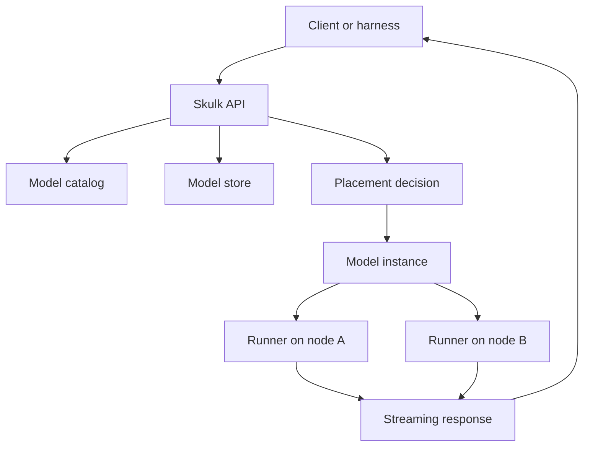

You do not need to know all of Skulk to use the harness, but a few words matter.
This page gives you the vocabulary you need before your first run.

## The Small Mental Model

Skulk exposes an API that looks similar to OpenAI chat and embeddings APIs, but
behind that API it manages a distributed cluster.

_Figure 1: A request can cross catalog lookup, model store state, placement,
runner startup, and streaming before the client sees text._

## Useful Words

| Word | Plain meaning | Why the harness cares |
| --- | --- | --- |
| API base URL | The HTTP address for Skulk, often `http://localhost:52415` | Every live command sends requests there |
| Model catalog | Skulk's known list of model cards | Selectors can choose models from it |
| Model store | Models already registered or downloaded in Skulk's store | Smoke tests often start with store models |
| Placement | A decision about where a model instance should run | The harness can preview and request placements |
| Instance | A running copy of a model across one or more nodes | Tests target an instance |
| Runner | The process on a node that serves part or all of a model | Runner health affects test results |
| Sharding | How a model is split across nodes | The harness exposes `Pipeline` and `Tensor` flags |
| Streaming | The response arrives in chunks | The harness measures time to first token and throughput |

## Why End-to-End Tests Need A Cluster

A unit test can check one Python function. A Skulk e2e test checks the path a
real user takes through the system.

That means the result depends on more than prompt quality. A failure might come
from any of these layers:

| Layer | Example problem |
| --- | --- |
| Config | The harness points at the wrong API URL |
| Store | The selected model is not downloaded |
| Placement | The cluster cannot fit the model on available nodes |
| Runner startup | A runner starts but never becomes ready |
| Streaming | Chunks stop arriving before the answer finishes |
| Scoring | The model answered, but failed the expected structure |
| Cleanup | A created instance remains after the test |

The harness records as much evidence as it can so you do not have to guess
where to start.

## Public Defaults Versus Foxlight Production

The public defaults are intentionally generic. They use model selectors such as
"first model in the store" instead of Foxlight hostnames or private paths.

Foxlight's production profile lives in `examples/foxlight/`. That profile uses
the real Foxlight cluster API and full batteries, but the public root config
does not.

:::warning
Do not commit private cluster URLs, SSH hostnames, local absolute paths, or
tokens to the public config files. Put them in `skulk-harness.yaml`, which is
ignored by git, or in an example file with placeholders.
:::
