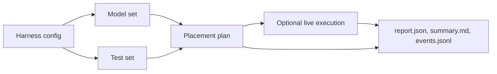

You have a [Skulk](https://github.com/Foxlight-Foundation/Skulk) cluster.
This tool answers two questions about it: **does it actually work**, and
**how fast is it?**

Point the harness at your cluster's API and it will place models, run real
chat, code, tool-calling, vision, and speech requests against them, measure
time-to-first-token and decode throughput, check the answers, and write an
honest report. You can keep those reports, compare them against later runs,
and (if you want) publish them to the public
[Skulk benchmarks ledger](https://benchmarks.foxlight.ai).

## Who this is for

- **Skulk operators** who want to know their cluster serves correct answers
  before they rely on it.
- **Benchmarkers** who want repeatable tokens-per-second numbers, with the
  noise called out instead of hidden.
- **Contributors** to Skulk who want to prove a change did not slow anything
  down, using like-for-like run comparisons.
- **Community members** who want to share what their hardware does on the
  public ledger.

You do not need to know harness vocabulary to start. A run is just a named
**model set** (which models to test) paired with a named **test set** (which
checks to run), and both are plain YAML.

## What the harness does



_Figure 1: A harness run combines one model set with one test set and writes a
report whether it is only planned or actually executed._

The harness answers practical questions:

| Question | Harness feature |
| --- | --- |
| Does my cluster serve correct answers? | `run` with pass/fail scoring |
| How fast is it? | TTFT and tokens/second in every report |
| Will this command touch my cluster? | Dry-run by default; `--execute` is explicit |
| Did my change make it faster or slower? | `compare` with trust guards |
| What breaks first under stress? | `stability` soak/failover/churn/refusal suites |
| How do I share my numbers? | `submit` to the community benchmarks ledger |

## Where to go

| Stage | Read this |
| --- | --- |
| **Start here** | [Quickstart](quickstart.md): from a fresh checkout to your first real run |
| **Understand** | [Skulk basics](concepts/skulk-basics.md), [what e2e testing means](concepts/e2e-testing.md), [the harness model](concepts/harness-model.md) |
| **Do things** | [First local run](guides/first-local-run.md), [write a model set](guides/write-model-set.md), [write a test set](guides/write-test-set.md), [compare runs](guides/compare-runs.md), [submit to the ledger](guides/submit-to-the-ledger.md), [stability suites](guides/stability-suites.md) |
| **Look things up** | [CLI reference](reference/cli.md), [configuration](reference/configuration.md), [model sets](reference/model-sets.md), [test sets](reference/test-sets.md), [reports](reference/reports.md) |
| **Something is wrong** | [Troubleshooting](troubleshooting.md) |

## Honest results, by construction

A benchmark number with no context is a rumor. The harness treats that as a
design problem, not a documentation problem:

- Every report carries a **fingerprint**: the Skulk version, the nodes and
  their hardware, and the cache conditions that produced the numbers. A
  number is never separated from what produced it. See
  [Reports](reference/reports.md).
- Every comparison carries **trust guards**: if two runs used different node
  sets, different cache states, or too few samples, `compare` says so instead
  of printing a confident delta. See
  [Compare runs](guides/compare-runs.md).
- The public site is **a ledger, not a leaderboard**. Community submissions
  are badged with the submitter and the hardware that produced them, reviewed
  before publication, and never blended into headline numbers. See
  [Submit to the ledger](guides/submit-to-the-ledger.md).

## The safe starting point

You can inspect the built-in model and test sets without a live cluster:

```bash
uv sync
uv run skulk-harness models sets --config skulk-harness.example.yaml
uv run skulk-harness tests sets --config skulk-harness.example.yaml
```

Those commands only load YAML and print tables. They are a good way to confirm
that your local checkout and Python environment work before involving a
cluster. When they do, head to the [Quickstart](quickstart.md).

## Two profiles

This repository ships two configurations:

| Profile | Where it lives | Who should use it |
| --- | --- | --- |
| Public defaults | `configs/` plus `skulk-harness.example.yaml` | Anyone testing their own Skulk cluster |
| Foxlight production | `examples/foxlight/` plus root wrapper scripts | Foxlight operators and existing automation |

The public defaults are cluster-neutral: they point at
`http://localhost:52415` and use generic model and test set names. The
Foxlight profile is the real production matrix that feeds the public ledger,
and it doubles as a worked example of a serious configuration. See
[Run the Foxlight profile](guides/run-foxlight-profile.md).

:::tip
If you are learning, start with the public defaults. Everything in the
Quickstart uses them.
:::
