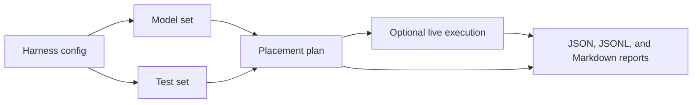

The Skulk Test Harness is a small command-line tool for checking whether a
Skulk cluster can place models, serve requests, stream answers, call tools,
return embeddings, handle cancellation, and write useful reports.

If you are new to Skulk or to end-to-end testing, you are in the right place.
This documentation starts from the basics and builds up slowly. You can begin
with commands that only read local YAML, then move to dry-run planning, then run
real tests against a live Skulk cluster when you are ready.

## What The Harness Does

Skulk is a distributed inference system. A request that looks simple from the
outside, such as "ask a model a question", may involve model store lookup,
placement, runner startup, streaming, result scoring, and cleanup. The harness
turns those steps into repeatable test runs.



_Figure 1: A harness run combines one model set with one test set and writes a
report whether it is only planned or actually executed._

The harness answers practical questions:

| Question | Harness feature |
| --- | --- |
| Which models should we test? | Named model sets |
| Which behaviors should we check? | Named test sets |
| Will a run mutate my cluster? | Dry-run by default |
| What happened during the run? | Report files under `runs/` |
| Can I keep private cluster details out of git? | Local `skulk-harness.yaml` ignored by git |
| Can Foxlight keep production batteries working? | Compatibility wrappers call `examples/foxlight/` |

## The Safe Starting Point

You can inspect the public model and test sets without a live cluster:

```bash
uv sync
uv run skulk-harness models sets --config skulk-harness.example.yaml
uv run skulk-harness tests sets --config skulk-harness.example.yaml
```

Those commands only load YAML and print tables. They are a good way to confirm
that your local checkout and Python environment are working.

## Two Profiles

This repository has two important profiles:

| Profile | Where it lives | Who should use it |
| --- | --- | --- |
| Public defaults | `configs/` plus `skulk-harness.example.yaml` | Anyone trying the harness against their own Skulk cluster |
| Foxlight production | `examples/foxlight/` plus root wrapper scripts | Foxlight operators and existing automation |

The public defaults are cluster-neutral. They point at `http://localhost:52415`
and use generic model and test set names.

The Foxlight profile is a real production example. The root scripts
`run_e2e_battery.sh`, `run_mtp_battery.sh`, and `run_throughput_battery.sh`
remain available for existing automation, but each script delegates to the
matching script under `examples/foxlight/`.

:::tip
If you are learning, start with the public defaults. If you are operating the
Foxlight cluster, use the wrapper scripts or pass
`--config examples/foxlight/skulk-harness.yaml`.
:::

## Where To Go Next

| If you want to... | Read this |
| --- | --- |
| Run the shortest safe commands | [Quickstart](quickstart.md) |
| Learn Skulk words like model store and runner | [Skulk basics](concepts/skulk-basics.md) |
| Understand what end-to-end testing means | [What e2e testing means](concepts/e2e-testing.md) |
| Make your first real run | [First local run](guides/first-local-run.md) |
| Write your own model list | [Write a model set](guides/write-model-set.md) |
| Write your own tests | [Write a test set](guides/write-test-set.md) |
| Use Foxlight production batteries | [Run the Foxlight profile](guides/run-foxlight-profile.md) |
| Decode report files | [Reports reference](reference/reports.md) |
